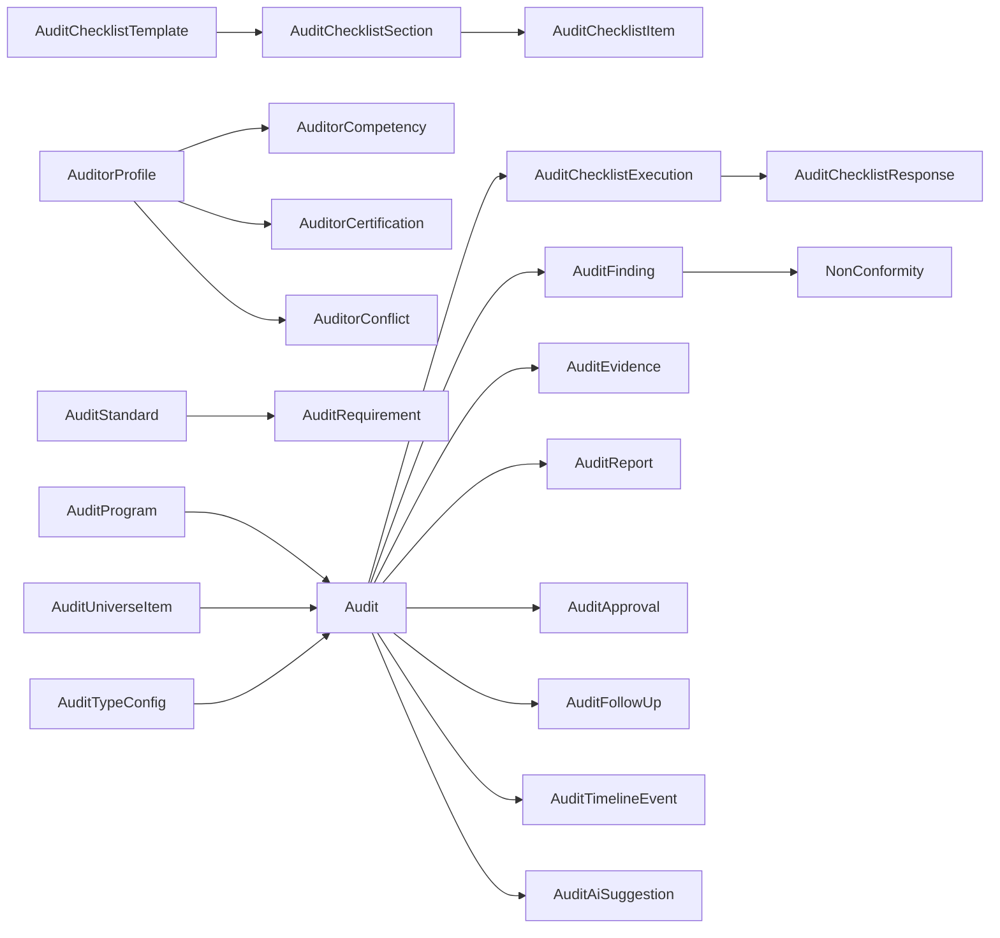

# Auditorias e Compliance

## Diagnostico

Antes desta evolucao o modulo possuia:

- `Audit` com numero sequencial, titulo, escopo, tipo, status, area, auditor lider e datas.
- `AuditFinding` para constatacoes simples.
- Geracao de Nao Conformidade a partir de constatacao, reutilizando o modulo `NonConformity`.
- Isolamento por `companyId` e filtro de area via `AccessService`.

## O Que Foi Criado

Migration: `20260605113000_audit_compliance_foundation`.

Novas familias de dados:

- Programa de auditorias: `AuditProgram`, `AuditProgramRevision`.
- Universo auditavel e planejamento por risco: `AuditUniverseItem`, `AuditRiskCriterion`, `AuditRiskScore`.
- Tipos configuraveis: `AuditTypeConfig`.
- Auditores, competencias e conflitos: `AuditorProfile`, `AuditorCompetency`, `AuditorCertification`, `AuditorAvailability`, `AuditorConflict`.
- Normas e requisitos: `AuditStandard`, `AuditRequirement`.
- Checklists: `AuditChecklistTemplate`, `AuditChecklistSection`, `AuditChecklistItem`, `AuditChecklistExecution`, `AuditChecklistResponse`.
- Evidencias: `AuditEvidence`.
- Classificacoes de constatacao: `AuditFindingClassification`.
- Relatorios, aprovacoes e follow-up: `AuditReport`, `AuditApproval`, `AuditFollowUp`.
- Governanca: `AuditTimelineEvent`, `AuditWorkflow`, `AuditNotificationRule`, `AuditExternalAccess`, `AuditAiSuggestion`.

## O Que Foi Reaproveitado

- Empresas, usuarios e areas continuam vindo de `Company`, `User` e `OrgNode`.
- A visibilidade por area continua no `AccessService`.
- Nao conformidades continuam no modulo `NonConformity`; constatacoes nao viram NC automaticamente.
- Evidencias textuais usam armazenamento local controlado do modulo de auditorias, preparado para trocar provider.
- A timeline tecnica do sistema continua em `TraceabilityService`, com timeline operacional adicional em `AuditTimelineEvent`.

## Fluxo Operacional

```text
Programa
  -> Universo auditavel + score de risco
  -> Planejamento da auditoria
  -> Validacao de area, auditor lider, competencia e conflitos
  -> Checklist / roteiro
  -> Execucao e autosave de respostas
  -> Evidencias
  -> Constatacoes
  -> NC opcional quando a classificacao exigir
  -> Follow-up / plano de acao externo
  -> Relatorio
  -> Aprovacao
  -> Conclusao / encerramento
  -> Timeline e indicadores
```

## Diagrama De Entidades



## APIs Principais

- `GET /audits`, `POST /audits`, `GET /audits/:id`, `PATCH /audits/:id`, `DELETE /audits/:id`
- `GET /audits/dashboard`, `GET /audits/summary`, `GET /audits/options`
- `POST /audits/:id/transition`, `/start`, `/complete`, `/reopen`
- `GET|POST /audits/programs`, `PATCH /audits/programs/:programId`
- `GET|POST /audits/universe`, `PATCH /audits/universe/:itemId`
- `GET|POST /audits/risk-criteria`, `PATCH /audits/risk-criteria/:criterionId`
- `GET|POST /audits/types`, `PATCH /audits/types/:typeId`
- `GET|POST /audits/auditors`, `PATCH /audits/auditors/:auditorId`, `POST /audits/auditors/suggest`
- `GET|POST /audits/standards`, `PATCH /audits/standards/:standardId`
- `GET|POST /audits/checklist-templates`, `PATCH /audits/checklist-templates/:templateId`
- `POST /audits/:id/checklists`
- `POST /audits/checklist-executions/:executionId/responses`
- `POST /audits/checklist-executions/:executionId/complete`
- `GET|POST /audits/:id/evidence`
- `POST /audits/:id/findings`, `PATCH|DELETE /audits/findings/:findingId`
- `POST /audits/findings/:findingId/nonconformity`
- `POST /audits/:id/report`, `PATCH /audits/reports/:reportId/decision`
- `POST /audits/:id/follow-ups`, `PATCH /audits/follow-ups/:followUpId`
- `POST /audits/:id/ai/suggestions`, `PATCH /audits/ai/suggestions/:suggestionId/decision`

## Permissoes

Base:

- `audits:view`, `audits:create`, `audits:update`, `audits:delete`, `audits:manage`.

Granulares:

- `audits:dashboard`
- `audits:plan`
- `audits:execute`
- `audits:findings`
- `audits:evidence`
- `audits:approve`
- `audits:close`
- `audits:reopen`
- `audits:export`
- `audits:programs`
- `audits:universe`
- `audits:types`
- `audits:auditors`
- `audits:checklists`
- `audits:standards`
- `audits:reports`
- `audits:followup`
- `audits:ai`

O guard aceita `audits:manage` como curinga do modulo.

## Regras Multiempresa E Visibilidade

- Toda listagem usa `me.companyId` do token autenticado.
- O frontend nao define `companyId` no fluxo final.
- Auditorias vinculadas a area usam `AccessService.listAreaFilter`.
- Criacao/edicao/exclusao chama `AccessService.assertCanWrite`.
- Programas com `orgNodeIds` respeitam a matriz de area.
- Constatacoes carregam `companyId` proprio, preenchido pela migration a partir de `Audit`.
- Registros sensiveis usam exclusao logica quando aplicavel.

## Workflow

Status suportados:

- `DRAFT`, `WAITING_APPROVAL`, `PLANNED`, `SCHEDULED`, `PREPARATION`, `READY_EXECUTION`
- `IN_PROGRESS`, `WAITING_COMPLEMENT`, `LEAD_REVIEW`, `WAITING_AUDITED_RESPONSE`
- `REPORT_ISSUED`, `FOLLOW_UP`, `COMPLETED`, `CLOSED`, `SUSPENDED`, `CANCELLED`, `RESCHEDULED`

Regras implementadas:

- Transicoes centrais expostas em `/transition`, `/start`, `/complete`, `/reopen`.
- Cancelamento exige justificativa no endpoint de transicao.
- Reabertura exige justificativa.
- Auditoria concluida/encerrada/cancelada nao aceita alteracao silenciosa de metadados principais.
- Toda mudanca relevante gera `AuditTimelineEvent`.

## Risco

O score do universo auditavel usa criterios configuraveis por empresa (`AuditRiskCriterion`).
O algoritmo atual calcula media ponderada a partir dos pesos cadastrados, grava `formulaSnapshot` e historico em `AuditRiskScore`.
Frequencia sugerida:

- `CRITICAL`: 90 dias.
- `HIGH`: 180 dias.
- `MODERATE`: 365 dias.
- `LOW`: 730 dias.

## IA Assistiva

O endpoint de IA cria sugestoes contextuais deterministicas e marcadas como sugestao.
Regras:

- IA nao aprova, nao encerra e nao altera registros de auditoria.
- Sugestoes ficam em `AuditAiSuggestion`.
- Aceite/rejeicao/aplicacao exige decisao humana.

## Tela Web

Rota: `/audits`.

Abas criadas:

- Dashboard.
- Auditorias.
- Programas.
- Universo.
- Checklists.
- Auditores.
- Normas.

Detalhe da auditoria:

- Visao geral.
- Checklist.
- Evidencias.
- Constatacoes.
- Relatorio.
- Historico.
- IA.

## Validacao

Executado:

- `pnpm --filter @g360/api exec prisma validate`
- `pnpm --filter @g360/api prisma:generate`
- `pnpm --filter @g360/api exec tsc --noEmit --pretty false`
- `pnpm --filter @g360/web exec tsc --noEmit --pretty false`
- `pnpm --filter @g360/api test -- audits.service.spec.ts`

Migration aplicada no Neon via:

- `pnpm --filter @g360/api deploy:migrate`

## Pendencias Planejadas

- PDF/Excel nativos para relatorios e exportacoes.
- Upload binario multipart completo para evidencias grandes.
- Sincronizacao offline/PWA para execucao em campo.
- Integracao automatica com reunioes e planos de acao por endpoint dedicado.
- Motor completo de notificacoes e escalonamentos.
- Importacao com preview/erros por linha.
- E2E autenticado quando credenciais validas estiverem disponiveis no banco alvo.
