# Fluxograma completo da aplicacao

Documentacao visual do projeto **Gestao 360 Indicadores**, criada para usuarios, gestores e equipes tecnicas entenderem o caminho completo da aplicacao: da configuracao inicial ao acompanhamento executivo, tratamento de desvios, planos de acao, reunioes, importacoes, relatorios, notificacoes e auditoria.

Esta documentacao foi montada a partir do `README.md`, schema Prisma, controllers/services do backend NestJS e rotas do frontend Next.js.

Arquivo para abrir no navegador: [fluxograma-completo.html](./fluxograma-completo.html)

## Legenda

| Simbolo | Significado |
| --- | --- |
| Caixa azul | Tela, modulo ou etapa acessada pelo usuario |
| Caixa verde | Regra de negocio automatica |
| Caixa amarela | Decisao, alerta ou ponto de atencao |
| Caixa vermelha | Risco, pendencia, atraso ou desvio |
| Banco | Persistencia via Prisma/PostgreSQL |

## 1. Visao geral da arquitetura

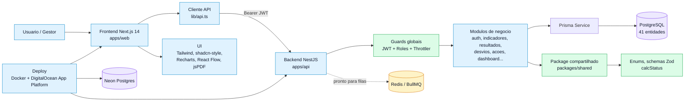

### Item por item

1. O usuario acessa o **frontend Next.js** em `apps/web`.
2. O frontend usa `apps/web/lib/api.ts` para chamar a API. Esse cliente adiciona `Authorization: Bearer <token>` e tenta renovar o access token automaticamente quando recebe `401`.
3. O backend NestJS roda com prefixo global `/api`, aplica `helmet`, CORS configuravel, `ValidationPipe`, filtro global de excecoes e limite de requisicoes com `Throttler`.
4. O `AuthModule` registra guards globais: JWT para proteger rotas e `RolesGuard` para endpoints com restricao de perfil.
5. Os modulos de negocio acessam o banco via `PrismaService`.
6. O banco modelado no Prisma e PostgreSQL possui 41 entidades, com `companyId` nas entidades de negocio para multiempresa.
7. O pacote `@g360/shared` concentra enums, schemas Zod e a regra `calcStatus`, usada por backend e frontend.
8. Redis/BullMQ estao instalados na stack, mas o fluxo atual de notificacoes e manual via `POST /notifications/generate`.
9. Em producao, o projeto esta preparado para Docker e DigitalOcean App Platform, com banco Neon Postgres.

## 2. Jornada ponta a ponta do sistema

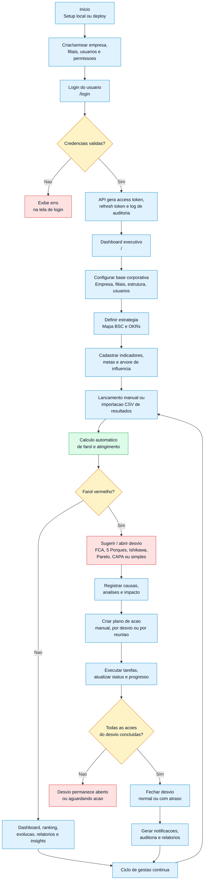

### Etapas operacionais

1. **Setup ou deploy**: `pnpm setup` no ambiente local ou deploy via `.do/app.yaml` na DigitalOcean.
2. **Dados iniciais**: seed cria empresa, estrutura, usuarios demo, permissoes, indicadores e dados realistas.
3. **Login**: o usuario entra por `/login`; a API valida senha bcrypt, usuario ativo e gera tokens.
4. **Sessao**: o frontend guarda tokens em `localStorage`; em falha de access token, chama `/auth/refresh`.
5. **Painel executivo**: gestores iniciam no dashboard com total de indicadores, farois, ranking, evolucao e pendencias.
6. **Base corporativa**: empresa, filiais, organograma e usuarios sustentam todos os filtros por area/responsavel.
7. **Estrategia**: mapa BSC, objetivos e OKRs conectam metas estrategicas ao acompanhamento operacional.
8. **Indicadores**: cada KPI tem area dona, responsavel, periodicidade, direcao de meta, unidade, fonte e peso.
9. **Metas**: metas sao cadastradas por `periodRef` canonico, como `YYYY-MM`, `YYYY-Q1`, `YYYY`, etc.
10. **Resultados**: o valor realizado pode ser lancado em lote na tela `/results` ou importado por CSV.
11. **Farol**: a regra `calcStatus` calcula verde, amarelo, vermelho ou cinza, alem de atingimento e desvios.
12. **Gestao do desvio**: se o farol fica vermelho, o sistema permite abrir desvio e conduzir analise de causa.
13. **Plano de acao**: acoes tratam desvios, reunioes, projetos, OKRs, objetivos ou demandas manuais.
14. **Controle de execucao**: subtarefas recalculam progresso; acoes concluidas fora do prazo viram `DONE_LATE`.
15. **Fechamento**: desvio nao fecha enquanto houver acao vinculada aberta.
16. **Aprendizado e governanca**: notificacoes, auditoria, relatorios e insights alimentam o proximo ciclo.

## 3. Fluxo de autenticacao e seguranca

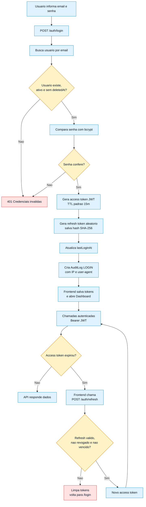

### Controles existentes

| Controle | Onde fica | Como funciona |
| --- | --- | --- |
| JWT obrigatorio | `AuthModule` / `JwtAuthGuard` | Rotas sao protegidas por padrao, exceto `@Public()` como login, refresh e health. |
| Refresh token | `AuthService` | Token bruto fica no cliente; hash SHA-256 fica no banco. |
| Perfil de acesso | `RolesGuard` + `@Roles` | Usado em criacao, ativacao e remocao de usuarios. |
| Tenant | `companyId` no payload JWT | Controllers filtram dados por empresa do usuario logado. |
| Auditoria | `AuditLog` | Login e consultas de auditoria estao implementados; demais acoes podem ser ampliadas. |
| Rate limit | `ThrottlerGuard` | Limite global configurado em 200 requisicoes por minuto. |

## 4. Fluxo de indicadores, metas e resultados

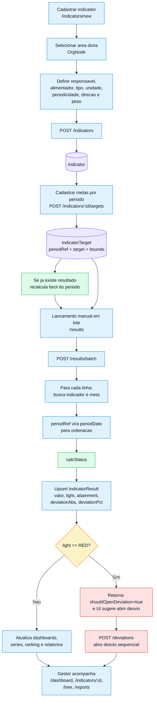

### Regras do farol

| Direcao da meta | Verde | Amarelo | Vermelho | Cinza |
| --- | --- | --- | --- | --- |
| `HIGHER_BETTER` | realizado maior ou igual a meta | abaixo da meta dentro da tolerancia | abaixo da tolerancia | sem valor ou sem meta |
| `LOWER_BETTER` | realizado menor ou igual a meta | acima da meta dentro da tolerancia | acima da tolerancia | sem valor ou sem meta |
| `EQUAL_TARGET` | distancia ate a meta dentro de metade da tolerancia | distancia dentro da tolerancia | distancia acima da tolerancia | sem valor ou sem meta |
| `RANGE` | realizado entre limite inferior e superior | fora da faixa, mas dentro da tolerancia | fora da faixa acima da tolerancia | sem valor ou sem meta |

### Telas envolvidas

| Tela | Funcao |
| --- | --- |
| `/indicators` | Lista indicadores, permite busca e filtro por farol. |
| `/indicators/new` | Cadastro completo do KPI. |
| `/indicators/:id` | Detalhe, historico, grafico meta x realizado, metas e abertura de desvio. |
| `/results` | Lancamento em lote dos ultimos periodos. |
| `/tree` | Grafo de influencia entre indicadores e simulacao de impacto. |
| `/reports` | PDF executivo no navegador e CSVs. |

## 5. Fluxo de desvios, causa raiz e planos de acao

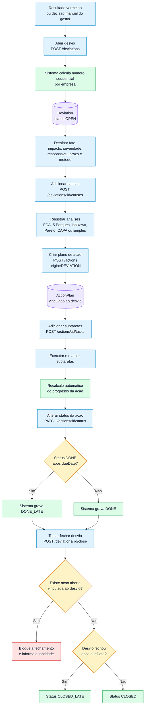

### Item por item

1. Um desvio nasce normalmente de indicador vermelho, mas tambem pode ser aberto manualmente pela tela do indicador.
2. O backend gera um numero sequencial por empresa para facilitar rastreabilidade.
3. A ficha do desvio aceita fato, causa raiz, impacto, severidade, responsavel, prazo e metodo de analise.
4. As causas podem ser categorizadas, por exemplo, usando 6M no Ishikawa.
5. Analises sao armazenadas como texto livre ou JSON serializado.
6. Acoes podem nascer do desvio e ficam vinculadas por `deviationId`.
7. Subtarefas controlam a execucao fina; ao marcar/desmarcar, o progresso da acao e recalculado.
8. Ao concluir uma acao depois do prazo, a regra grava `DONE_LATE`.
9. O fechamento do desvio e bloqueado se ainda houver acao diferente de `DONE` ou `DONE_LATE`.
10. Se o desvio for fechado depois do prazo, o status final vira `CLOSED_LATE`.

## 6. Fluxo estrategico: BSC, objetivos e OKRs

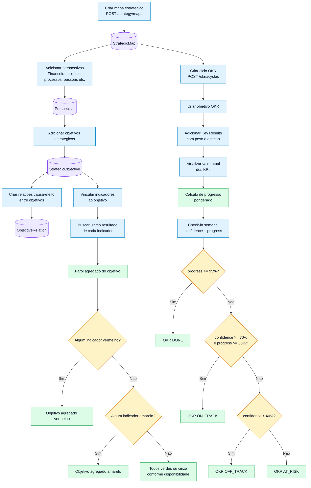

### Como o gestor usa

| Modulo | Uso gerencial |
| --- | --- |
| Mapa BSC | Mostra a estrategia em perspectivas e objetivos, com farol agregado pelos indicadores vinculados. |
| Relacoes causa-efeito | Mostram dependencia entre objetivos estrategicos. |
| OKRs | Traduzem objetivos em ciclos, objetivos mensuraveis, KRs e check-ins. |
| Check-in | Atualiza confianca e status automaticamente: `DONE`, `ON_TRACK`, `OFF_TRACK` ou `AT_RISK`. |

## 7. Fluxo de arvore de indicadores e simulacao de impacto

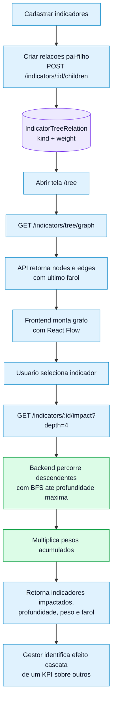

## 8. Fluxo de reunioes, projetos e execucao

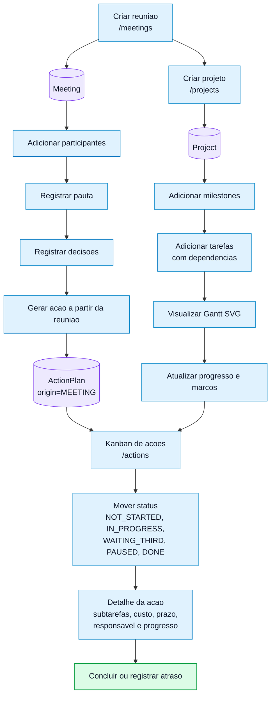

### Pontos de controle

| Area | Controle |
| --- | --- |
| Reunioes | Participantes, presenca, pauta, decisoes e geracao de acao. |
| Acoes | Kanban, prioridade, responsavel, area, origem, prazo, progresso e subtarefas. |
| Projetos | Marcos, tarefas, dependencias e visualizacao em Gantt. |
| Atrasos | Acoes vencidas aparecem em filtros, notificacoes e dashboard. |

## 9. Fluxo de importacao CSV

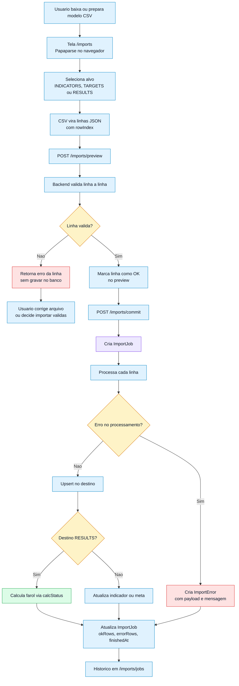

### Validacoes importantes

| Alvo | Validacao principal | Gravacao |
| --- | --- | --- |
| `INDICATORS` | `code` e `name` obrigatorios; `ownerCode` precisa existir. | Upsert de indicador por `companyId + code`. |
| `TARGETS` | `code`, `periodRef` e `target` numerico; indicador precisa existir. | Upsert de meta por `indicatorId + periodRef`. |
| `RESULTS` | `code`, `periodRef` e `value` numerico; indicador precisa existir. | Upsert de resultado e calculo automatico do farol. |

## 10. Fluxo de dashboard, insights, notificacoes e relatorios

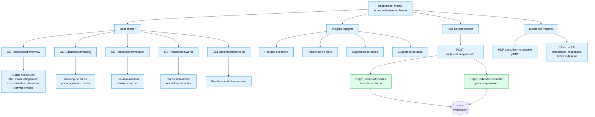

### Como a informacao executiva e formada

| Saida | Origem dos dados |
| --- | --- |
| Total e farois | Ultimo resultado de cada indicador ativo. |
| Atingimento geral | Media dos atingimentos, limitada para evitar distorcao extrema. |
| Ranking de areas | Agrupa indicadores por `ownerNodeId`. |
| Evolucao | Resultados mensais dos ultimos N meses. |
| Piores indicadores | Indicadores com ultimo farol vermelho, ordenados por pior atingimento. |
| Insights | Heuristicas locais; nao chama IA externa no estado atual. |
| Notificacoes | Geradas sob demanda por regras de indicador vermelho e acao atrasada. |
| Relatorios | CSVs no backend e PDF executivo gerado no frontend. |

## 11. Fluxo de dados principais

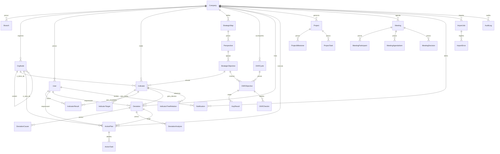

### Entidades por dominio

| Dominio | Entidades |
| --- | --- |
| Organizacao | `Company`, `Branch`, `OrgNode`, `User`, `Permission`, `UserPermission`, `RefreshToken` |
| Estrategia | `StrategicMap`, `Perspective`, `StrategicObjective`, `ObjectiveRelation` |
| OKR | `OKRCycle`, `OKRObjective`, `KeyResult`, `OKRCheckin` |
| KPI | `Indicator`, `IndicatorTarget`, `IndicatorResult`, `IndicatorTreeRelation` |
| Desvio e acao | `Deviation`, `DeviationCause`, `DeviationAnalysis`, `ActionPlan`, `ActionTask` |
| Execucao | `Project`, `ProjectMilestone`, `ProjectTask`, `Meeting`, `MeetingParticipant`, `MeetingAgendaItem`, `MeetingDecision` |
| Suporte | `Attachment`, `Comment`, `Notification`, `ImportJob`, `ImportError`, `AuditLog`, `AppSetting` |

## 12. Fluxo de setup local e deploy

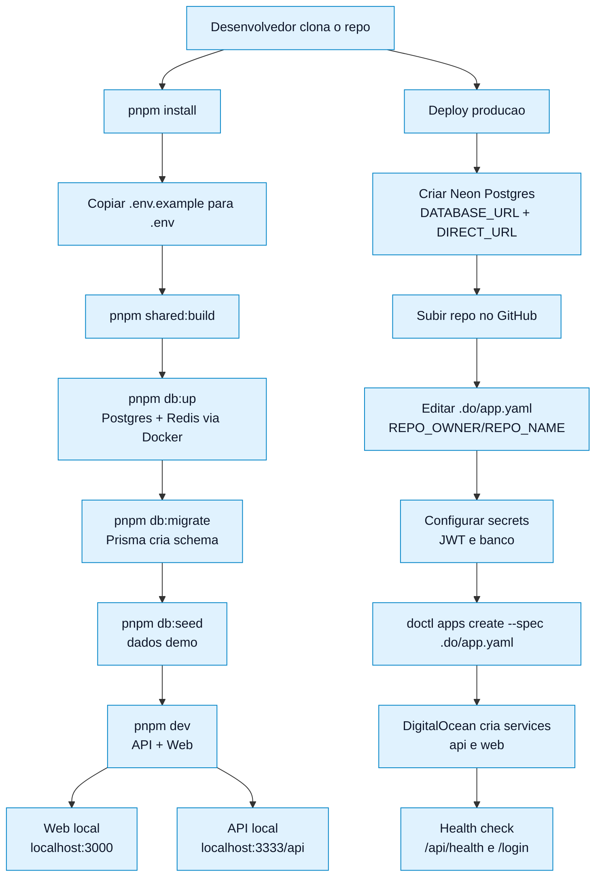

## 13. Mapa de navegacao por perfil de uso

| Perfil | Primeiro uso recomendado | Rotas principais |
| --- | --- | --- |
| Diretoria | Acompanhar resultado consolidado e riscos. | `/`, `/insights`, `/strategy`, `/okrs`, `/reports` |
| Gestor de area | Cuidar indicadores, lancamentos, desvios e acoes da area. | `/indicators`, `/results`, `/deviations`, `/actions`, `/tree` |
| Analista | Alimentar dados, importar CSV, montar relatorios e apoiar causas. | `/results`, `/imports`, `/reports`, `/audit` |
| PMO / Projetos | Controlar cronogramas, marcos, tarefas e reunioes. | `/projects`, `/meetings`, `/actions` |
| Administrador | Manter empresa, estrutura e usuarios. | `/settings`, `/org`, `/users`, `/audit` |

## 14. Mapa completo das telas

| Secao da sidebar | Rota | O que entrega |
| --- | --- | --- |
| Visao | `/` | Dashboard executivo com KPIs, farois, ranking, evolucao, criticos e pendencias. |
| Visao | `/insights` | Heuristicas locais de resumo, tendencia, causa e acao. |
| Estrategia | `/strategy` | Lista de mapas estrategicos. |
| Estrategia | `/strategy/:id` | Mapa BSC com perspectivas, objetivos, farol agregado e status inline. |
| Estrategia | `/okrs` | Ciclos, objetivos, KRs, check-ins e progresso ponderado. |
| Performance | `/indicators` | Lista de indicadores com filtros. |
| Performance | `/indicators/new` | Cadastro de indicador. |
| Performance | `/indicators/:id` | Detalhe, serie historica, metas, historico e abertura de desvio. |
| Performance | `/results` | Lancamentos em lote dos resultados. |
| Performance | `/tree` | Arvore de indicadores e simulacao de impacto. |
| Execucao | `/deviations` | Lista de desvios com severidade e contagens. |
| Execucao | `/deviations/:id` | Analise completa do desvio, causas, metodos e fechamento. |
| Execucao | `/actions` | Kanban de planos de acao. |
| Execucao | `/actions/:id` | Detalhe da acao, subtarefas, status, custo, datas e progresso. |
| Execucao | `/projects` | Lista de projetos e progresso. |
| Execucao | `/projects/:id` | Gantt, marcos, tarefas e dependencias. |
| Execucao | `/meetings` | Lista e criacao de reunioes. |
| Execucao | `/meetings/:id` | Pauta, participantes, decisoes e gerador de acao. |
| Dados | `/imports` | Wizard CSV com preview, erros por linha e commit. |
| Dados | `/reports` | PDF executivo e exportacoes CSV. |
| Empresa | `/org` | Estrutura organizacional em arvore. |
| Empresa | `/users` | Usuarios e perfis. |
| Empresa | `/audit` | Auditoria com filtros por entidade e acao. |
| Empresa | `/settings` | Dados da empresa e filiais. |

## 15. API por modulo

| Modulo | Endpoints principais | Papel no fluxo |
| --- | --- | --- |
| `auth` | `POST /auth/login`, `POST /auth/refresh`, `POST /auth/logout`, `GET /auth/me` | Entrada, sessao, renovacao e identidade do usuario. |
| `companies` | `GET /companies/me`, `GET /companies/me/branches` | Dados da empresa logada e filiais. |
| `users` | `GET /users`, `POST /users`, `PATCH /users/:id/active`, `DELETE /users/:id` | Gestao de usuarios, com criacao/ativacao/remocao restritas a admin. |
| `orgnodes` | `GET /orgnodes`, `GET /orgnodes/tree`, CRUD, `PATCH /:id/move` | Organograma e areas donas dos indicadores. |
| `indicators` | CRUD, `/series`, `/targets`, `/children`, `/tree/graph`, `/impact` | KPIs, metas, series, arvore e simulacao. |
| `results` | `/pending`, `POST /results`, `POST /results/batch`, `POST /:id/approve` | Lancamentos, calculo de farol e aprovacao/rejeicao. |
| `deviations` | CRUD, `/causes`, `/analyses`, `/close` | Desvios, causa raiz, analises e fechamento controlado. |
| `actions` | CRUD, `/status`, `/tasks` | Planos de acao, Kanban, subtarefas e progresso. |
| `dashboard` | `/overview`, `/ranking`, `/evolution`, `/worst`, `/pending` | Agregacoes executivas. |
| `strategy` | `/maps`, `/perspectives`, `/objectives`, `/relations`, vinculo de indicadores | Mapa estrategico BSC. |
| `okrs` | `/cycles`, `/objectives`, `/krs`, `/checkin` | Ciclos OKR, KRs, progresso e confianca. |
| `projects` | CRUD, `/milestones`, `/tasks` | Projetos, Gantt, marcos e dependencias. |
| `meetings` | CRUD, participantes, pauta, decisoes, `/actions` | Reunioes e geracao de acoes. |
| `notifications` | `/`, `/count`, `/read`, `/read-all`, `/generate` | Sino, contagem e regras de alerta. |
| `imports` | `/preview`, `/commit`, `/jobs`, `/jobs/:id/errors` | Importacao CSV validada linha a linha. |
| `reports` | `/indicators.csv`, `/results.csv`, `/actions.csv`, `/deviations.csv` | Exportacoes para Excel/BI. |
| `insights` | `GET /insights` | Heuristicas executivas sem IA externa. |
| `audit` | `GET /audit` | Rastro consultavel por empresa, entidade e acao. |
| `health` | `GET /health` | Health check publico. |

## 16. Regras de negocio consolidadas

| Regra | Onde aparece | Resultado |
| --- | --- | --- |
| `calcStatus` compartilhado | `packages/shared/src/status.ts` | Mesmo calculo de farol no front e no back. |
| Meta alterada recalcula resultado existente | `IndicatorsService.upsertTarget` | Evita farol desatualizado quando a meta muda. |
| Resultado vermelho sugere desvio | `ResultsService.upsert` | Retorna `shouldOpenDeviation: true`. |
| Desvio recebe numero sequencial por empresa | `DeviationsService.open` | Facilita gestao e rastreabilidade. |
| Fechamento de desvio exige acoes concluidas | `DeviationsService.close` | Bloqueia encerramento prematuro. |
| Acao concluida em atraso vira `DONE_LATE` | `ActionsService.changeStatus` | Mantem historico do prazo. |
| Subtarefas recalculam progresso | `ActionsService.recalcProgress` | Progresso sempre coerente com tarefas. |
| Ranking de areas usa ultimo resultado | `DashboardService.ranking` | Gestao compara areas pelo atingimento. |
| Objetivo BSC agrega farol dos indicadores | `StrategyService.getMap` | Vermelho prevalece, depois amarelo, depois verde. |
| OKR usa progresso ponderado | `OkrsService.enrich` | KRs com maior peso impactam mais o objetivo. |
| Check-in define status OKR | `OkrsService.checkin` | `DONE`, `ON_TRACK`, `OFF_TRACK` ou `AT_RISK`. |
| Importacao valida antes de gravar | `ImportsService.preview` | Erros aparecem por linha antes do commit. |
| Notificacao evita duplicidade aberta | `NotificationsService.generateAlerts` | Nao cria alerta repetido nao lido para o mesmo link. |
| Soft delete | Diversos services | Registros sao inativados via `deletedAt`, nao apagados fisicamente. |

## 17. Leitura gerencial do ciclo

O sistema implementa um ciclo PDCA/gestao a vista:

1. **Planejar**: estrutura organizacional, estrategia, objetivos, OKRs, indicadores e metas.
2. **Executar**: lancar resultados, executar projetos, reunioes e planos de acao.
3. **Checar**: dashboards, farois, ranking, evolucao, relatorios, insights e notificacoes.
4. **Agir**: abrir desvios, analisar causa raiz, criar acoes, acompanhar prazos e fechar somente quando resolvido.
5. **Aprender**: auditoria, historico, tendencias e relatorios alimentam a proxima rodada de metas.

## 18. Observacoes importantes

- Apesar do nome da pasta conter `sqlite`, o schema atual usa **PostgreSQL** via Prisma.
- Redis/BullMQ esta na stack, mas as filas ainda nao foram implementadas; alertas rodam sob demanda.
- Os insights sao heuristicas locais, nao chamadas a uma IA externa.
- O isolamento multiempresa depende de `companyId` nos filtros da aplicacao; nao ha RLS no Postgres no estado atual.
- O catalogo de permissoes existe, mas o enforcement detalhado por permissao ainda nao esta espalhado por todos os endpoints.

