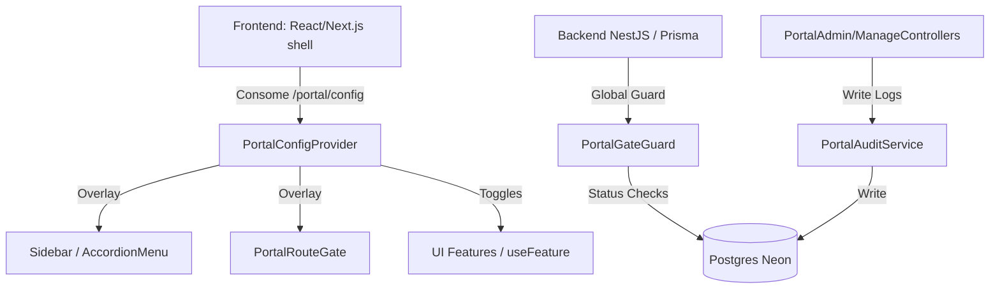

# Central de Administração do Portal (Configurações > Central de Administração do Portal)

> [!NOTE]
> Este documento descreve o Painel Mestre do Sistema, criado exclusivamente para o perfil **Super Admin** administrar de forma visual e em tempo real todo o funcionamento do portal Gestão 360.
> Rota no frontend: `/settings/portal`. Rota base no backend: `/api/admin/portal`.

---

## 1. Objetivo & Visão Geral
A Central de Administração do Portal centraliza o gerenciamento operacional do Gestão 360, permitindo ativar/desativar módulos, bloquear páginas, configurar permissões, gerenciar feature flags, definir escopos de acesso, gerenciar janelas de manutenção, editar parâmetros de sistema, monitorar integrações, emitir comunicados, restaurar backups de configurações e analisar a saúde do portal.

---

## 2. Decisões de Arquitetura



* **Arquitetura de Overlay:** Em vez de definir tudo dinamicamente em banco (o que degradaria performance), o portal usa a estrutura em código (`navigation.ts` e rotas) como base, aplicando um **overlay dinâmico** a partir de registros e overrides no banco.
* **Segurança Tríplice:** A segurança é garantida por (1) restrição de acesso à tela no frontend, (2) `SuperAdminPortalGuard` nos endpoints administrativos no backend, e (3) `PortalGateGuard` global bloqueando endpoints regulares se o recurso correspondente estiver inativo/bloqueado/em manutenção.
* **Auditoria Imutável:** Todas as alterações feitas na Central são registradas na tabela `PortalAdminAuditLog` e não podem ser apagadas pelo painel (sem exclusão silenciosa).
* **Anti-lockout (Segurança Anti-auto-bloqueio):** Módulos críticos (`auth`, `database-admin`, `portal-admin`, `settings`) são marcados como não bloqueáveis. O backend e o frontend recusam desativá-los para evitar perda de acesso acidental do Super Admin.

---

## 3. Estrutura de Arquivos
* **Backend (`apps/api/src/modules/portal-admin/`):**
  * [portal-admin.module.ts](file:///d:/Projetos/gestao-indicadores-sqlite/apps/api/src/modules/portal-admin/portal-admin.module.ts) - Registro de controllers, services e guards.
  * [portal-catalog.ts](file:///d:/Projetos/gestao-indicadores-sqlite/apps/api/src/modules/portal-admin/portal-catalog.ts) - Catálogo-semente estático de módulos, páginas e funcionalidades do portal.
  * [portal-admin.constants.ts](file:///d:/Projetos/gestao-indicadores-sqlite/apps/api/src/modules/portal-admin/portal-admin.constants.ts) - Constantes de segurança e lockout.
  * `controllers/` - [portal-admin.controller.ts](file:///d:/Projetos/gestao-indicadores-sqlite/apps/api/src/modules/portal-admin/controllers/portal-admin.controller.ts), [portal-manage.controller.ts](file:///d:/Projetos/gestao-indicadores-sqlite/apps/api/src/modules/portal-admin/controllers/portal-manage.controller.ts), [portal-config.controller.ts](file:///d:/Projetos/gestao-indicadores-sqlite/apps/api/src/modules/portal-admin/controllers/portal-config.controller.ts).
  * `services/` - `PortalOverviewService`, `RegistryService`, `FeatureFlagService`, `ScopeService`, `NavigationService`, `MaintenanceService`, `ParameterService`, `IntegrationService`, `AnnouncementService`, `SnapshotService`, `PortalDiagnosticsService`, `PermissionViewService`, `PortalAuditService`, `PortalConfigService`.
  * `guards/` - `SuperAdminPortalGuard` (bloqueia intrusos), `PortalGateGuard` (bloqueio regular e manutenção).
* **Frontend (`apps/web/`):**
  * [app/(app)/settings/portal/page.tsx](file:///d:/Projetos/gestao-indicadores-sqlite/apps/web/app/(app)/settings/portal/page.tsx) - Container principal com a navegação de 15 abas.
  * [components/portal-admin/portal-config-provider.tsx](file:///d:/Projetos/gestao-indicadores-sqlite/apps/web/components/portal-admin/portal-config-provider.tsx) - Carrega a configuração resolvida e fornece hooks de controle como `useFeature(key)`.
  * [components/portal-admin/portal-route-gate.tsx](file:///d:/Projetos/gestao-indicadores-sqlite/apps/web/components/portal-admin/portal-route-gate.tsx) - Exibe tela de manutenção/indisponibilidade amigável.
  * [components/portal-admin/portal-announcements.tsx](file:///d:/Projetos/gestao-indicadores-sqlite/apps/web/components/portal-admin/portal-announcements.tsx) - Renderizador global de banners e modais de comunicados.
  * `components/portal-admin/tabs/` - Componentes individuais para cada uma das 15 abas.

---

## 4. Estrutura de Banco de Dados (PostgreSQL Neon)
A migration aditiva `20260602010000_portal_admin` adicionou as seguintes tabelas:
* `PortalModule` - Armazena metadados de status e restrições de cada módulo.
* `PortalPage` - Armazena as páginas individuais e permissões.
* `PortalFeature` - Toggles de menor nível de cada funcionalidade.
* `PortalFeatureFlag` - Feature flags com percentual de rollout e filtros.
* `PortalNavOverride` - Ordenação e visibilidade customizada de itens de menu.
* `PortalScopeRule` - Restrição de escopo organizacional por Empresa/Filial/Área/Usuário.
* `PortalMaintenanceWindow` - Agendamento de manutenções globais ou específicas.
* `PortalIntegration` - Catálogo e status de saúde de integrações externas.
* `PortalAnnouncement` - Banners e modais ativos de avisos para usuários.
* `PortalAdminAuditLog` - Log de ações e tentativas indevidas de acesso.
* `PortalConfigSnapshot` - Backup do estado completo das configurações para rollback imediato.
* `PortalDiagnosticRun` - Histórico de execuções de testes de integridade.

---

## 5. Guias de Cadastro e Extensão

### A. Como cadastrar um Novo Módulo
1. Abra [portal-catalog.ts](file:///d:/Projetos/gestao-indicadores-sqlite/apps/api/src/modules/portal-admin/portal-catalog.ts).
2. Adicione um novo objeto na lista `CATALOG_MODULES`:
   ```typescript
   {
     code: 'novo-modulo',
     name: 'Novo Módulo Incrível',
     category: 'Lançamentos',
     route: '/novo-modulo',
     menuOrder: 150,
     criticality: 'medium',
     dependencies: [],
   }
   ```
3. Acesse a aba **Configurações Avançadas** no painel administrativo e clique em **Ressincronizar Registro**. O módulo será inserido na base.

### B. Como cadastrar uma Nova Página
1. No arquivo [portal-catalog.ts](file:///d:/Projetos/gestao-indicadores-sqlite/apps/api/src/modules/portal-admin/portal-catalog.ts), vá na lista `CATALOG_PAGES`.
2. Insira a nova página vinculando-a ao código do módulo correspondente:
   ```typescript
   {
     code: 'nova-pagina-view',
     moduleCode: 'novo-modulo',
     name: 'Visualização Detalhada',
     title: 'Nova Página',
     route: '/novo-modulo/detalhes',
   }
   ```
3. Clique em **Ressincronizar Registro** para aplicar as atualizações.

### C. Como cadastrar uma Nova Funcionalidade
1. Em [portal-catalog.ts](file:///d:/Projetos/gestao-indicadores-sqlite/apps/api/src/modules/portal-admin/portal-catalog.ts), na lista `CATALOG_FEATURES`:
   ```typescript
   {
     code: 'recurso:criar-item',
     moduleCode: 'novo-modulo',
     name: 'Permite criar novo item',
     criticality: 'medium',
   }
   ```
2. Após salvar, clique em **Ressincronizar Registro** no painel.

### D. Como cadastrar uma Nova Feature Flag
1. Vá para a aba **Funcionalidades** da Central de Administração.
2. Na sub-seção **Feature Flags**, clique em **Nova Flag**.
3. Defina a chave (ex: `enable_cool_dashboard`), descrição, percentual de liberação (0-100), datas de agendamento (opcional), e perfis autorizados.
4. No frontend, utilize o hook `useFeature` para renderizar condicionalmente:
   ```tsx
   import { useFeature } from '@/components/portal-admin/portal-config-provider';
   
   function MyComponent() {
     const hasCoolDashboard = useFeature('enable_cool_dashboard');
     return hasCoolDashboard ? <CoolDashboard /> : <ClassicDashboard />;
   }
   ```

### E. Como cadastrar um Novo Item de Menu
1. Adicione a rota no arquivo de menu regular do frontend (`navigation.ts`).
2. Para alterar seu rótulo, ícone ou ordenação sem mexer no código, vá na aba **Menus e Navegação** no painel.
3. Insira o item com as sobreposições desejadas (ocultação, grupo, ordem customizada) e salve.

### F. Como cadastrar um Novo Parâmetro Geral
1. Parâmetros dinâmicos são carregados da tabela `AppSetting`.
2. Para adicionar um novo parâmetro, basta adicioná-lo na tabela através de seed ou script. Ele aparecerá automaticamente listado na aba **Parâmetros Gerais**, onde poderá ser editado.

### G. Como cadastrar uma Nova Integração
1. Novas integrações são gerenciadas pelo `IntegrationService` no backend.
2. Para adicionar suporte a testes de uma nova API:
   * Abra [integration.service.ts](file:///d:/Projetos/gestao-indicadores-sqlite/apps/api/src/modules/portal-admin/services/integration.service.ts).
   * Adicione o código de teste correspondente no método `test(code)`.

---

## 6. Procedimento de Restauração & Snapshots
> [!WARNING]
> A restauração de versões anteriores é uma operação crítica.

Antes de reverter as configurações para um snapshot:
1. O sistema calcula a diferença e a exibe detalhadamente em tela.
2. O sistema gera automaticamente um **snapshot preventivo** contendo as configurações atuais (para garantir rollback imediato se necessário).
3. O Super Admin deve digitar a frase **CONFIRMAR ALTERAÇÃO CRÍTICA** no formulário para autorizar a operação.

---

## 7. Diagnóstico do Portal
A aba **Diagnóstico** executa uma bateria de testes de integridade read-only:
* **Rotas Inconsistentes:** Localiza páginas configuradas que não possuem correspondência nas tabelas de rotas e menu do frontend.
* **Endpoints Sem Proteção:** Varre endpoints críticos do módulo verificando se estão devidamente cobertos pelo `SuperAdminPortalGuard`.
* **Saúde de Integrações:** Executa ping HTTP e conexões contra o banco de dados Postgres Neon, SMTP de email e APIs de inteligência artificial.
* **Inconsistências de Permissões:** Identifica se existem permissões órfãs ou associadas a papéis inexistentes.
