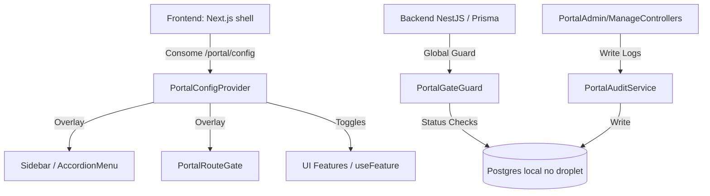

# Central de Administracao do Portal

Este documento descreve o Painel Mestre do Sistema, criado para o perfil `SUPER_ADMIN` administrar o funcionamento do portal Gestao 360.

- Rota frontend: `/settings/portal`.
- Rota backend: `/api/admin/portal`.
- Banco de producao: Postgres local no droplet, nao Neon.

## Objetivo

A Central de Administracao do Portal centraliza o gerenciamento operacional do Gestao 360. Ela permite ativar/desativar modulos, bloquear paginas, configurar permissoes, gerenciar feature flags, definir escopos de acesso, gerenciar janelas de manutencao, editar parametros de sistema, monitorar integracoes, emitir comunicados, restaurar snapshots de configuracao e analisar a saude do portal.

## Decisoes de arquitetura



- **Arquitetura de overlay:** a estrutura em codigo (`navigation.ts` e rotas) e a base. Registros e overrides no banco aplicam visibilidade, bloqueios, ordem e flags.
- **Seguranca tripla:** acesso restrito no frontend, `SuperAdminPortalGuard` nos endpoints administrativos e `PortalGateGuard` global nos endpoints regulares.
- **Auditoria imutavel:** alteracoes da Central sao registradas em `PortalAdminAuditLog`; o painel nao oferece exclusao silenciosa.
- **Anti-lockout:** modulos criticos (`auth`, `database-admin`, `portal-admin`, `settings`) nao podem ser bloqueados pelo proprio painel.

## Modulos por empresa via flags

A decisao vigente e controlar modulos por empresa via Portal Admin/Platform Admin, usando catalogo, planos, overrides e feature flags.

Fluxo esperado:

1. `PlatformModuleCatalog` define o catalogo comercial/operacional de modulos.
2. `PlatformPlan` e `PlatformPlanModule` definem o pacote padrao contratado.
3. `PlatformCompanyModule` e `PlatformCompanyPlanOverride` liberam, bloqueiam ou ajustam modulos para uma empresa especifica.
4. `PortalModule`, `PortalPage`, `PortalFeature` e `PortalFeatureFlag` resolvem o overlay do portal para navegacao, telas e recursos finos.
5. O frontend consome `/portal/config` e aplica menu, gates e `useFeature(key)`.
6. O backend aplica guardas para impedir acesso por URL direta quando modulo/pagina/recurso estiver desativado.

Consequencia pratica: uma empresa pode ter Auditorias, Processos, Formularios, Seguranca Patrimonial, Premiacoes ou qualquer modulo corporativo liberado sem mudar o codigo da navegacao para cada cliente.

## Estrutura de arquivos

Backend:

- `apps/api/src/modules/portal-admin/portal-admin.module.ts`: registro de controllers, services e guards.
- `apps/api/src/modules/portal-admin/portal-catalog.ts`: catalogo-semente de modulos, paginas e funcionalidades.
- `apps/api/src/modules/portal-admin/portal-admin.constants.ts`: constantes de seguranca e lockout.
- `apps/api/src/modules/portal-admin/controllers/`: controllers administrativos e de configuracao.
- `apps/api/src/modules/portal-admin/services/`: overview, registry, flags, escopos, navegacao, manutencao, parametros, integracoes, comunicados, snapshots, diagnostico, permissoes, auditoria e config.
- `apps/api/src/modules/portal-admin/guards/`: `SuperAdminPortalGuard` e `PortalGateGuard`.

Frontend:

- `apps/web/app/(app)/settings/portal/page.tsx`: container principal.
- `apps/web/components/portal-admin/portal-config-provider.tsx`: carrega configuracao resolvida e expoe hooks como `useFeature(key)`.
- `apps/web/components/portal-admin/portal-route-gate.tsx`: renderiza bloqueio/manutencao.
- `apps/web/components/portal-admin/portal-announcements.tsx`: banners e modais globais.
- `apps/web/components/portal-admin/tabs/`: abas da Central.

## Estrutura de banco de dados

A migration `20260602010000_portal_admin` adicionou:

- `PortalModule`: metadados de status e restricoes de modulos.
- `PortalPage`: paginas individuais e permissoes.
- `PortalFeature`: toggles de funcionalidades.
- `PortalFeatureFlag`: flags com rollout e filtros.
- `PortalNavOverride`: ordenacao e visibilidade customizada.
- `PortalScopeRule`: restricao de escopo por empresa, filial, area ou usuario.
- `PortalMaintenanceWindow`: manutencoes globais ou especificas.
- `PortalIntegration`: catalogo e status de integracoes externas.
- `PortalAnnouncement`: banners e modais.
- `PortalAdminAuditLog`: log de acoes e tentativas indevidas.
- `PortalConfigSnapshot`: snapshot para rollback.
- `PortalDiagnosticRun`: historico de diagnosticos.

Entidades Platform Admin relacionadas:

- `PlatformModuleCatalog`
- `PlatformPlan`
- `PlatformPlanModule`
- `PlatformCompanyModule`
- `PlatformCompanyPlanOverride`
- `PlatformFeatureFlagTarget`

## Como cadastrar um novo modulo

1. Abra `apps/api/src/modules/portal-admin/portal-catalog.ts`.
2. Adicione um novo objeto em `CATALOG_MODULES`.
3. Cadastre paginas em `CATALOG_PAGES` e recursos em `CATALOG_FEATURES`.
4. Ressincronize o registro pela Central.
5. No Platform Admin, associe o modulo ao plano ou libere por empresa.

Exemplo:

```typescript
{
  code: 'novo-modulo',
  name: 'Novo Modulo',
  category: 'Gestao',
  route: '/novo-modulo',
  menuOrder: 150,
  criticality: 'medium',
  dependencies: [],
}
```

## Como usar feature flags

1. Acesse a aba de funcionalidades da Central.
2. Crie a flag com chave, descricao, percentual de liberacao, datas e perfis autorizados.
3. No frontend, use `useFeature(key)`.

```tsx
import { useFeature } from '@/components/portal-admin/portal-config-provider';

export function MyComponent() {
  const enabled = useFeature('enable_cool_dashboard');
  return enabled ? <CoolDashboard /> : <ClassicDashboard />;
}
```

## Snapshots e restauracao

A restauracao de configuracoes e critica.

Antes de reverter:

1. O sistema calcula e exibe a diferenca.
2. O sistema cria um snapshot preventivo do estado atual.
3. O Super Admin confirma a frase de alteracao critica antes de aplicar.

## Diagnostico

A aba Diagnostico executa testes read-only:

- Rotas inconsistentes entre catalogo, tabelas e frontend.
- Endpoints criticos sem `SuperAdminPortalGuard`.
- Saude de integracoes: Postgres local, SMTP e APIs externas.
- Permissoes orfas ou associadas a papeis inexistentes.

## Validacao de seguranca

Antes de considerar esta area pronta em producao:

- `/settings/portal` deve ser acessivel apenas a `SUPER_ADMIN`.
- `/settings/database` deve ser acessivel apenas a `SUPER_ADMIN`.
- Modulo/pagina desligado deve sumir do menu e bloquear URL direta.
- Modulos anti-lockout nao podem ser desativados.
